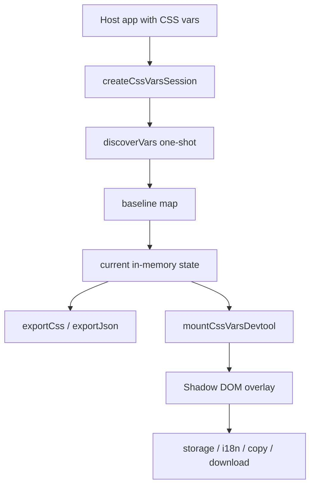

# Architecture

## Table of contents

- [Overview](#overview)
- [Layer boundaries](#layer-boundaries)
- [Runtime flow](#runtime-flow)
- [Module map](#module-map)
- [State and lifecycle](#state-and-lifecycle)
- [Browser overlay responsibilities](#browser-overlay-responsibilities)
- [Validation and export pipeline](#validation-and-export-pipeline)
- [Current pre-release gaps](#current-pre-release-gaps)
- [Testing strategy](#testing-strategy)

---

## Overview

`@inume/css-vars-devtools` is split into two public layers:

1. a **headless core** for discovery, session state, reset, and export
2. an optional **browser overlay** for dev-only interaction

This keeps the state model reusable while isolating UI, storage, and browser-only concerns.

> Current status: the high-level separation is correct, but there are still some **pre-release alignment gaps** between the v1 spec and the current implementation.

---

## Layer boundaries

| Layer | Responsibilities | Examples |
|---|---|---|
| `src/shared` | types, normalization, validation, serialization | `types.ts`, `validate-exportable-value.ts` |
| `src/core` | discovery, baseline, session state, exports | `discover-vars.ts`, `create-session.ts` |
| `src/browser` | overlay UI, i18n, storage, downloads, production guard | `create-overlay.ts`, `storage.ts`, `i18n.ts` |

---

## Runtime flow



---

## Module map

```text
src/
  shared/
    constants.ts
    normalize-color.ts
    normalize-name.ts
    serialize-css.ts
    serialize-json.ts
    types.ts
    validate-exportable-value.ts
  core/
    discover-vars.ts
    filters.ts
    create-session.ts
  browser/
    create-overlay.ts
    download.ts
    i18n.ts
    mount-devtool.ts
    production-guard.ts
    storage.ts
    storage-schema.ts
    styles.ts
```

---

## State and lifecycle

### Core session

- baseline is captured once during discovery
- current values live in memory
- `resetVar()` and `resetAll()` restore the baseline
- `destroy()` makes the session inert
- the intended v1 default scope is broad by runtime color value

### Browser handle

- may own its session or consume an external one
- unmounts overlay resources on `destroy()`
- keeps browser-only concerns out of the core

> The architectural intent is full teardown on `destroy()`. That lifecycle symmetry is part of the remaining browser hardening before release.

---

## Browser overlay responsibilities

Current browser responsibilities implemented in code:

- Shadow DOM UI isolation
- floating toggle button and draggable panel
- active variable editing through native color input
- variable filtering and selection
- copy/download actions
- opt-in persistence
- locale resolution and message merging
- production guard evaluation before mounting

The overlay runtime is intentionally limited to:

- TypeScript
- vanilla DOM APIs
- Shadow DOM

No framework adapter or runtime UI framework is part of the browser architecture.

---

## Validation and export pipeline

### Validation

`validateExportableValue()` currently accepts:

- hex colors
- `rgb()` / `rgba()`
- `hsl()` / `hsla()`

It rejects dangerous tokens such as:

- `url(`
- `expression(`
- `@`
- `;`
- CSS comments

### Export

- `serializeCss()` emits a stable `:root { ... }` block
- `serializeJson()` emits a stable JSON schema with `version` + `vars`
- non-exportable raw values stay out of public exports

---

## Current pre-release gaps

These are known architecture-relevant gaps that still need alignment before release:

1. **Discovery contract alignment**
   - Discovery is intentionally broad by runtime color value.
   - Documentation and tests must keep `prefixes` framed as narrowing filters, not as the default requirement.

2. **Public package surface**
   - The public API is limited to `@inume/css-vars-devtools` and `@inume/css-vars-devtools/browser`.
   - `./package.json` is intentionally not exported to keep the v1 surface strict.

3. **Browser teardown hardening**
   - The architectural intent is full cleanup of browser-owned resources on `destroy()`.
   - Global listeners and drag-related teardown are still part of release hardening.

4. **Overlay hot paths**
   - The current overlay works correctly functionally, but some interaction paths still do more DOM work than ideal during pointer-driven updates.
   - This is a performance concern, not a layer-boundary failure.

---

## Testing strategy

| Level | Tool | Scope |
|---|---|---|
| Unit / contract | Vitest + happy-dom | core logic, browser contracts, overlay behaviors |
| Real browser smoke | Playwright | discovery, copy, download, overlay basics through `examples/vanilla` |

Important current gap in test intent:

- the suite should keep explicit coverage for broad-by-runtime-color discovery and prefix narrowing
- browser teardown and integration cleanup deserve explicit coverage before release

Current scripts:

```bash
npm test
npm run test:smoke
```
